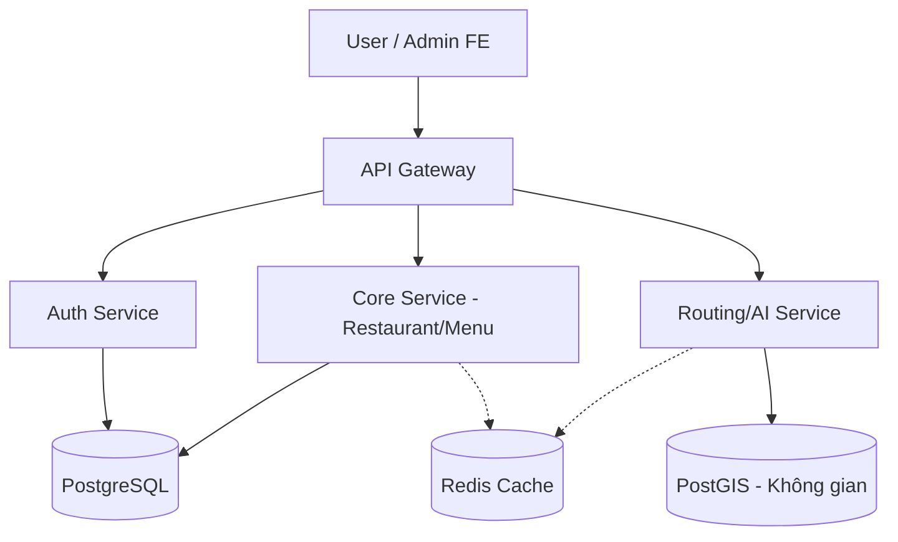
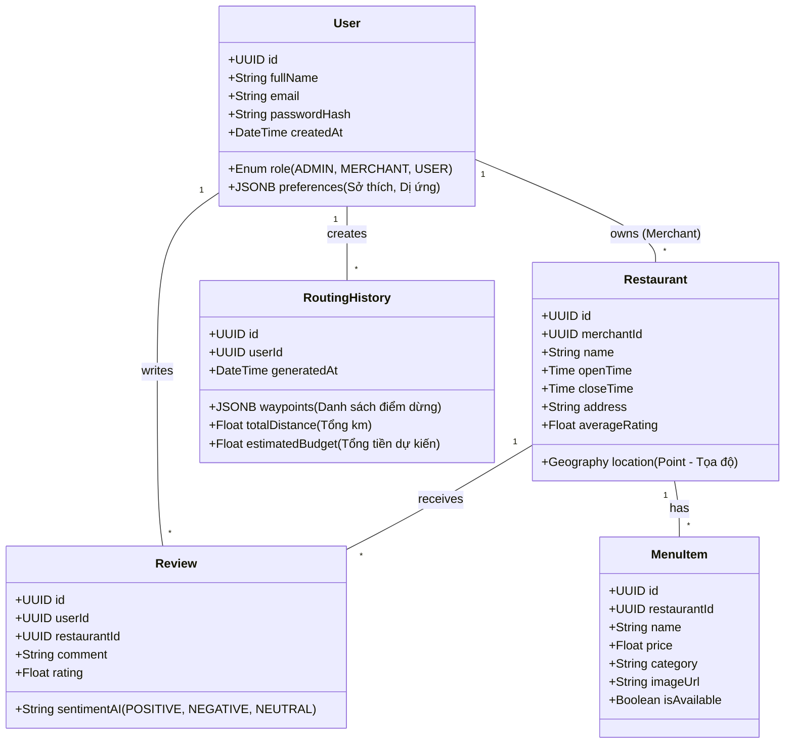

# TÀI LIỆU PHỤC VỤ VIẾT BÁO CÁO KLTN & BÀI BÁO KHOA HỌC
**Tên đề tài**: Nghiên cứu và xây dựng hệ thống GastroWise - Tối ưu hóa lộ trình di chuyển và Cá nhân hóa trải nghiệm ẩm thực.

---

## 1. MỤC TIÊU VÀ ĐÓNG GÓP CỦA ĐỀ TÀI (Novelty & Contributions)
Hệ thống GastroWise không chỉ là một ứng dụng tra cứu địa điểm ăn uống thông thường, mà giải quyết bài toán cốt lõi: **Tối ưu hóa đa mục tiêu (Khoảng cách - Thời gian - Ngân sách - Sở thích)**. 

### Điểm mới (Novelty) để đưa vào Bài Báo Khoa Học:
- **Thuật toán Tối ưu hóa Lộ trình (Routing Optimization)**: Hệ thống sử dụng dữ liệu không gian (Spatial Data) từ PostGIS để tính toán lộ trình ngắn nhất đi qua các điểm ẩm thực thỏa mãn ràng buộc về ngân sách và thời gian của người dùng.
- **Trợ lý AI phân tích Dữ liệu (AI Merchant Insights)**: Cung cấp cho chủ nhà hàng (Merchant) công cụ tự động phân tích cảm xúc bình luận (Sentiment Analysis) và gợi ý chiến lược kinh doanh vào các khung giờ thấp điểm.

---

## 2. KIẾN TRÚC HỆ THỐNG (System Architecture)
Dự án được xây dựng theo kiến trúc **Microservices** hướng dịch vụ, kết hợp với các bộ nhớ đệm tốc độ cao, đảm bảo tính mở rộng (Scalability) và dễ dàng bảo trì.

### 2.1. Sơ đồ Luồng dữ liệu (Data Flow)

- **Frontend (Client & Admin)**: Tách biệt hoàn toàn thành 2 ứng dụng độc lập, giao tiếp với Backend thông qua RESTful APIs (được phân luồng bởi API Gateway). 
- **Lưu trữ đa phương tiện (Media Storage)**: Áp dụng cơ chế lưu trữ đám mây thông qua **Cloudinary** để giảm tải băng thông cho server nội bộ và tăng tốc độ phân phối ảnh (CDN).
- **Môi trường triển khai (Deployment)**: Hệ thống được container hóa toàn bộ bằng **Docker** (`docker-compose`), kết hợp **Redis** để Cache dữ liệu (như cache lại kết quả API tối ưu lộ trình), đảm bảo môi trường thực thi đồng nhất từ khâu phát triển (Development) đến vận hành thực tế (Production).

### 2.2. Lược đồ Thực thể - Mối quan hệ (Class Diagram / ERD)
Để phục vụ cho thuật toán gợi ý điểm đến và tối ưu lộ trình, cơ sở dữ liệu được thiết kế tập trung vào tính tương quan giữa Người dùng (Sở thích/Ngân sách) và Nhà hàng (Menu/Giá):

#### Phân tích chi tiết các Bảng Dữ liệu (Entities Analysis):
1. **Bảng User**: Phân quyền hệ thống với trường `role` (Admin quản trị hệ thống, Merchant chủ quán, User khách hàng). Điểm đặc biệt nhất là trường `preferences` (Kiểu JSONB), cho phép lưu trữ sở thích ăn uống linh hoạt (Ví dụ: "thích ăn cay", "dị ứng hải sản") mà không cần tạo thêm nhiều bảng rườm rà.
2. **Bảng Restaurant**: Áp dụng kiểu dữ liệu `Geography (Point)` của PostGIS để lưu trữ kinh độ và vĩ độ chính xác. Điều này cho phép Backend dễ dàng truy vấn SQL để tìm "các nhà hàng bán kính 5km".
3. **Bảng MenuItem**: Liên kết 1-N với Restaurant.
4. **Bảng Review**: Chứa trường `sentimentAI`, được cập nhật ngầm thông qua thuật toán AI mỗi khi có bình luận mới. Giúp hiển thị cảnh báo cho Merchant trên trang Admin FE.
5. **Bảng RoutingHistory**: Lưu trữ lại lộ trình AI đã sinh ra cho người dùng để Cache (Redis) tái sử dụng hoặc Thống kê đánh giá thói quen di chuyển.

---

## 3. CÔNG NGHỆ ÁP DỤNG Ở FRONTEND (Frontend Technology Stack)
Mọi quyết định chọn công nghệ đều dựa trên yếu tố hiệu năng (Performance) và Khả năng bảo trì (Maintainability):

1. **Next.js 15 (React 19)**: 
   - Sử dụng mô hình *App Router* và *Server Components* giúp giảm thiểu lượng JavaScript gửi xuống Client, tăng tốc độ tải trang (TTV) và tối ưu hóa SEO.
2. **Tailwind CSS v4**:
   - Sử dụng engine CSS hiện đại, biên dịch trực tiếp không qua cấu hình phức tạp. Không phụ thuộc vào thư viện Component UI cồng kềnh (như MUI/Antd), toàn bộ UI được code custom (Feature-Sliced Design) để UI nhẹ nhất và tùy biến 100%.
3. **React Query (@tanstack/react-query)**:
   - Thay vì dùng Redux cồng kềnh, React Query được sử dụng để quản lý Server State, cung cấp cơ chế tự động Caching, Deduping requests (gộp các request trùng lặp) và Background fetching. Cực kỳ hữu ích khi thao tác với dữ liệu biến động liên tục như Bảng xếp hạng món ăn hay Trạng thái đặt bàn.
4. **Kiến trúc Thư mục (Modular / Feature-Sliced Design)**:
   - Mã nguồn không gộp chung vào 1 rổ, mà được chia làm 2 lớp: `src/shared/` (dành cho UI Components chung, Axios Client) và `src/modules/` (chứa logic tách biệt cho Auth, User, Restaurant). Giúp làm việc nhóm hiệu quả và không bị conflict mã nguồn (Git Conflict).

---

## 4. ĐÓNG GÓP TÍNH NĂNG AI DOANH NGHIỆP (Enterprise AI Capabilities)
Dự án không chỉ tập trung vào nghiệp vụ cơ bản mà còn đưa vào các tính năng Trí tuệ Nhân tạo (AI) giúp tối ưu hóa vận hành cho Chủ nhà hàng (Merchant), tạo thành điểm sáng tạo cốt lõi (Novelty):
- **AI Copilot (Trợ lý ảo thông minh)**: Giao diện Chatbot thu nhỏ luôn thường trực trên toàn hệ thống Admin. Cho phép chủ nhà hàng sử dụng ngôn ngữ tự nhiên để truy vấn dữ liệu (Vd: "Phân tích doanh thu tháng này").
- **AI Menu Generator (Tự động hóa dữ liệu)**: Tích hợp công nghệ nhận diện hình ảnh (Computer Vision / AI Vision). Merchant chỉ cần tải ảnh món ăn lên, hệ thống sẽ tự sinh ra đoạn mô tả hấp dẫn (Copywriting) và gợi ý mức giá bán tối ưu dựa trên dữ liệu đối thủ cạnh tranh trong cùng khu vực.
- **Thống kê & Cảnh báo Sentiment (AI Dashboard)**: Dùng thuật toán phân tích sắc thái ngữ nghĩa để bóc tách từ khóa "Tích cực/Tiêu cực" từ hàng ngàn reviews, từ đó phát ra cảnh báo.

---

## 5. CHI TIẾT CÁC MODULE QUẢN TRỊ KHÁC (Admin Modules Implementation)
Báo cáo kỹ thuật cần mô tả rõ UX/UI của các chức năng quản trị:
- **Quản lý Đặt bàn (Kanban Board)**: Ứng dụng kỹ thuật kéo-thả (Drag & Drop) chia theo trạng thái: Chờ duyệt, Đã nhận bàn, Hoàn thành. Cung cấp trực quan luồng công việc cho Merchant.
- **Quản lý Thực đơn (Menu Grid)**: Cung cấp tính năng bật/tắt (Toggle) tính sẵn sàng của món ăn (Available/Out of stock) theo thời gian thực. Cùng với AI Menu Generator để thêm món nhanh chóng.
